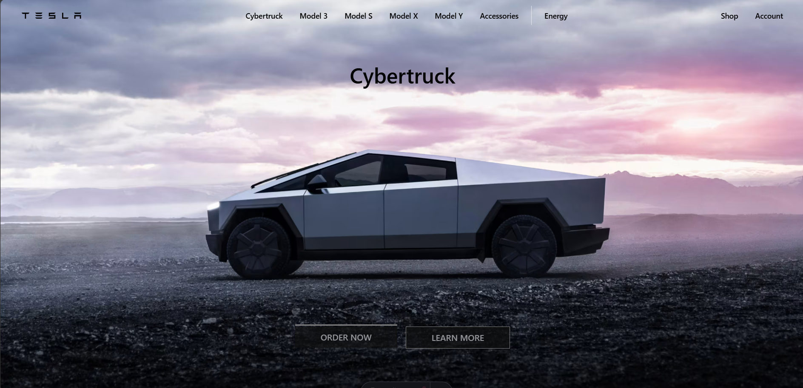

# Tesla Landing Page 🚗

**Tesla Landing Page** es una réplica de la página de inicio de Tesla, creada con **HTML**, **CSS**, **JavaScript**, **Astro** y **Tailwind CSS**. El objetivo es practicar técnicas de diseño web moderno, rendimiento, y experiencia de usuario.

## 📸 Vista previa

Incluye una imagen o GIF de demostración (coloca en `public/preview.png`):



---

## 🛠️ Tecnologías

* **Astro** – Framework para sitios estáticos y rendimiento optimizado.
* **Tailwind CSS** – Utilidades CSS de bajo nivel, personalizadas.
* **JavaScript** – Interactividad mínima (menú, scroll suave, sliders).

Basado en ejemplos similares:

* midudev/landing-tesla: Astro + Tailwind + JS ([github.com][1], [github.com][2], [github.com][3])
* emapeire/tesla‑landing: réplica similar con licencia MIT ([github.com][4])

## ⚙️ Instalación y uso

1. Clona el repositorio:

   ```bash
   git clone https://github.com/SmillRivera14/tesla-landing.git
   cd tesla-landing
   ```

2. Instala dependencias:

   ```bash
   npm install
   ```

3. Ejecuta en modo de desarrollo:

   ```bash
   npm run dev
   ```

   Luego abre `http://localhost:3000` en tu navegador.

4. Para producción:

   ```bash
   npm run build
   npm run preview
   ```

## 📌 Estructura del proyecto

```
├── public/              # Archivos estáticos (imágenes, favicon)
├── src/
│   ├── components/      # Componentes reutilizables
│   ├── layouts/         # Layout principal
│   ├── pages/           # Páginas .astro
│   └── styles/          # Estilos personalizados CSS
├── tailwind.config.cjs  # Configuración de Tailwind CSS
├── astro.config.mjs     # Configuración de Astro
└── package.json         # Scripts y dependencias
```

## ✅ Características

* Diseño responsive adaptado a móviles y escritorio.
* Animaciones y transiciones suaves.
* Optimización para Lighthouse (rendimiento, accesibilidad, SEO).
* Uso de scroll snap para secciones elegantes .
* Lazy loading para imágenes.
* Menú de navegación de tipo “sticky” o fijo.

## 🧠 Lo que aprendí

Al igual que en clones similares ([github.com][2]), este proyecto te permite practicar:

* Uso de **Astro** y su workflow.
* Integración de **Tailwind CSS** y diseño utility‑first.
* Técnicas de responsive con `object-fit`, `scroll-snap`.
* Posicionamiento con `flex`, `position`, `z-index`.
* Animaciones con `translate`, `opacity`, `scale`.
* Mejora de **SEO**, **accesibilidad** y **rendimiento web**.
